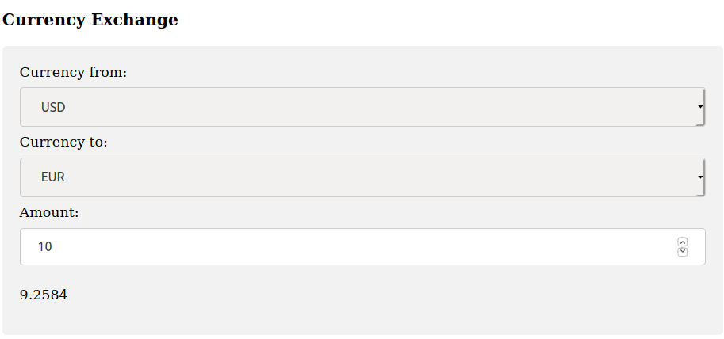

# cew_nodejs
Simple currency exchange wigged on nodejs



## Run
```
node server.js
```
## Call
```
curl -sb -H "Accept: application/json" "http://127.0.0.1:3000/quote?base_currency=USD&quote_currency=EUR&base_amount=1222"
```
